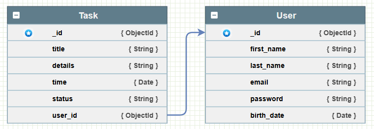

# Task Manager Application
>
> A simple task management application built with the Node js & Mongo db for CRUD operations, task filtering, and user authentication.

## Table of Contents

- [Features](#features)
- [Technologies Used](#technologies-used)
- [How To Use](#how-to-use)
- [Code Structure](#code-structure)
- [Documentation](#documentation)
- [References](#references)

---

## Features

- **CRUD Operations**: Users can create, read, update, and delete tasks.
- **Task Status Management**: Mark tasks as completed or incomplete.
- **Task Filtering**: Filter tasks by status (e.g., completed, incomplete).
- **Optional User Authentication**: Users can sign up, log in, and manage their own tasks (optional feature).
- **Data Validation and Code Architecture**: Ensures clean code structure and validation for task-related data.
  
[Back To The Top](#task-manager-application)

## Technologies Used

- **Node.js** - JavaScript runtime for the server-side application.
- **Express** - Web framework for Node.js, used to build RESTful APIs.
- **MongoDB** - NoSQL database for storing tasks and user data.

[Back To The Top](#task-manager-application)

---

## How To Use

### Prerequisites

- Ensure **Node.js** and **MongoDB** are installed on your machine.

### Installation

1. **Clone the Repository**

    ```bash
    git clone https://github.com/MohdFarag/eyego-task-manager
    cd task-manager-application/backend/
    ```

2. **Install Dependencies**

    ```bash
    npm install
    ```

3. **Set Up Env. Variables**

    Create a `.env` file in the backend directory and add the following variables:

    ```env
    MONGO_URI=<your-mongodb-connection>
    PORT=3000
    JWT_SECRET=<your-jwt-secret>
    ```

4. **Start MongoDB**

    ```bash
    mongod
    ```

5. Run the server

    ```bash
    node server.js
    ```

[Back To The Top](#task-manager-application)

---

## Code Structure

The project organized into the following directories:

- **backend/** - Contains the main application code.
  - **config/** - Includes configuration files (database connection setup).
  - **helper/** - Contains helper functions & classes for endpoints
  - **routes/** - Includes routes endpoints implementation for the application.
    - **middleware/** - Includes middleware for authentication and validation.

[Back To The Top](#task-manager-application)

---

## Documentation

### Database Structure



### API Endpoints

- **Tasks**
  - `POST /tasks/new` - Create a new task.
  - `GET /tasks` - Retrieve all tasks or filter by status.
  - `GET /tasks/:task_id` - Retrieve a single task by ID.
  - `PUT /tasks/:task_id` - Update a task by ID.
  - `PUT /tasks/:task_id/complete` - Mark a task as completed.
  - `PUT /tasks/:task_id/incomplete` - Mark a task as incomplete.
  - `DELETE /tasks/all` - Delete all tasks.
  - `DELETE /tasks/:task_id` - Delete a task by ID.

- **User Authentication** (optional)
  - `POST /signup` - Register a new user.
  - `POST /login` - Log in an existing user.
  
For full API documentation: [Task Manager API](https://documenter.getpostman.com/view/34560791/2sAY519gMo).

[Back To The Top](#task-manager-application)

---

## References

- **Mongoose Documentation**: [https://mongoosejs.com/](https://mongoosejs.com/)

- **Date Parse File** : [https://stackoverflow.com/a/5510783/15919672](https://stackoverflow.com/a/5510783/15919672)

[Back To The Top](#task-manager-application)

---
